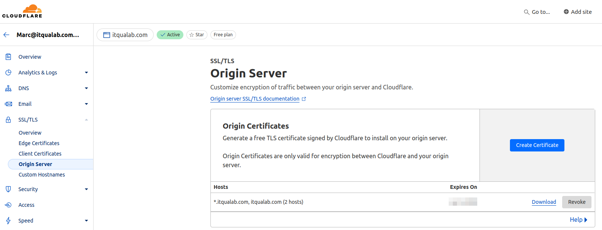
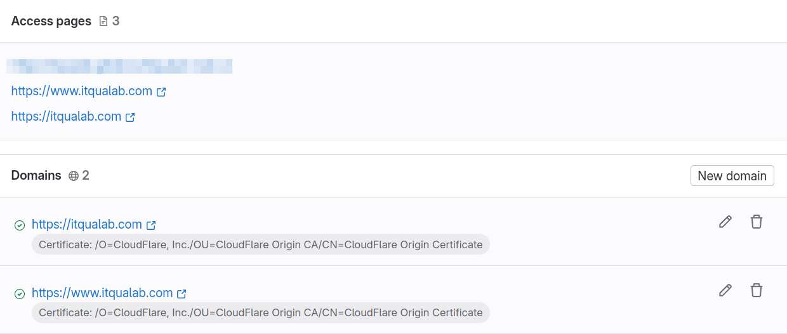
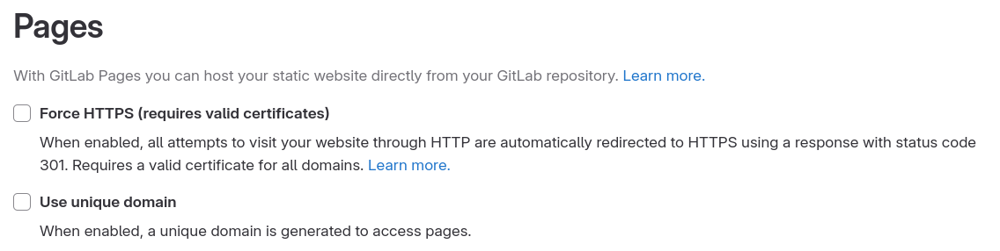
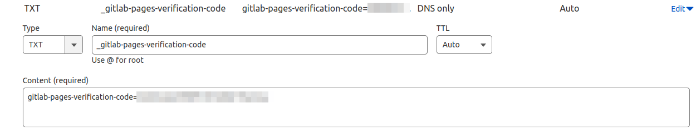
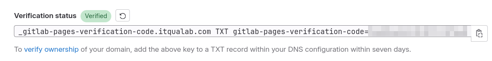
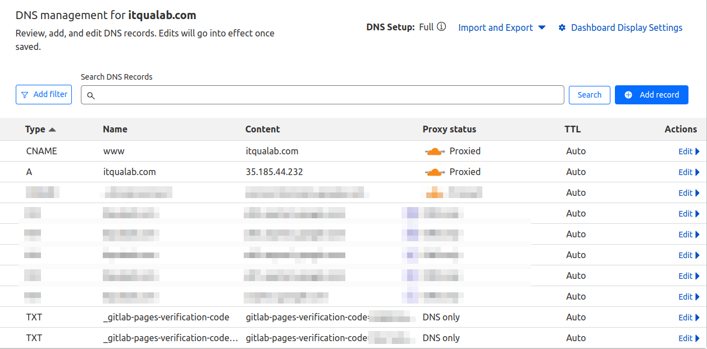

## Overview

Setting up a custom domain for a GitLab Pages site using Cloudflare can be challenging due to unclear or outdated documentation. This blog post clarifies the process by providing a step-by-step guide. Following this post, you can configure your Cloudflare domain for GitLab Pages, ensuring that both the apex and www domains work seamlessly with SSL certificates.

## Official Documentation
- **Cloudflare**: [Connect Your Domain](https://developers.cloudflare.com/fundamentals/setup/manage-domains/connect-your-domain/)
- **GitLab**: [Set Up a Custom Domain](https://docs.gitlab.com/ee/user/project/pages/custom_domains_ssl_tls_certification/index.html#set-up-a-custom-domain)

# The Problem
Cloudflare and GitLab provide documentation on configuring custom domains and SSL certificates, but those docs need to be more explicit, complete and current. For quite a long time, I have faced many issues with the integration due to the following:
- Ambiguous instructions and incomplete examples.
- Long wait times for DNS propagation, making trial and error frustrating.
- Challenges in getting the apex domain (example.com) and www subdomain (www.example.com) to work correctly with SSL certificates.

# The Solution
After much experimentation, I've identified several key steps not explicitly mentioned in the official guides but crucial for a successful setup. Here's a detailed breakdown:

## Step 1: Generate an SSL Certificate in Cloudflare, not on the Gitlab domain setup.

1. **Log in to your Cloudflare account.**
2. **Navigate to the SSL/TLS settings** for your domain.
3. **Select “Origin Server”** from the menu. This section allows you to create a new SSL certificate.
4. **Click on "Create Certificate."** In the dialogue that appears, Cloudflare will generate a new certificate and private key.
5. **Save the certificate and private key.** You will need to input this certificate in your GitLab settings.



## Step 2: Complete the Cloudflare Certificate for GitLab

1. **Visit the Cloudflare Root CA repository** and download the [root CA certificate](https://developers.cloudflare.com/ssl/origin-configuration/origin-ca/#cloudflare-origin-ca-root-certificate) (download the Cloudflare Origin RSA PEM `.pem` file). This root certificate ensures compatibility with GitLab.

2. **Combine the Cloudflare certificate with the root CA certificate**. This step can be done by appending the contents of the root CA certificate after your Cloudflare-origin certificate file. Your combined certificate file should look like this:

    ```text
    -----BEGIN CERTIFICATE-----
    [Your Cloudflare Certificate]
    -----END CERTIFICATE-----
    -----BEGIN CERTIFICATE-----
    [Cloudflare Root CA Certificate]
    -----END CERTIFICATE-----
    ```

## Step 3: Register the Gitlab domain

1. **Log in to your GitLab account** and navigate to your project's settings.
2. **Go to "Pages"** under the "Settings" menu.
3. **Scroll down to the "Domains" section** and click "New Domain."
4. **Enter your domain name** (example.com or www.example.com).
5. **Deactivate the Automatic certificate management using Let's Encrypt**.
6. **Paste the combined certificate** from Step 2 into the "Certificate" field and the private key from Cloudflare into the "Key" field.



* Note: Leave the Pages checkboxes unchecked. 



## Step 4: Verify the domain
1. **Create a TXT DNS record in Cloudflare**. Copy the 'Verification status' code from Gitlab, but do not paste it all directly into Cloudflare. The verification status code has three parts separated by one whitespace.
i.e "_gitlab-pages-verification-code.itqualab.com TXT gitlab-pages-verification-code=..."
The first part is the name, the second is the type, and the third is the actual code. You can copy and paste all the verification statuses to the Cloudflare content field but then copy the first part (the name) and delete the first and second parts, leaving only the third part into the content field. Then, paste the name to the cloud flare name field and select the TXT type. 



2. **In the GitLab domain settings, click the button to retry the verification** It may take a few seconds; keep trying.



## Step 5: Configure DNS Records in Cloudflare

1. **Return to your Cloudflare dashboard** and navigate to the DNS settings for your domain.
2. **Create an A record** for your apex domain:
   - **Name**: `@` (this denotes the root domain, example.com)
   - **IPv4 address**: `35.185.44.232` (GitLab’s IP address)
   - **Proxy status**: **Proxied**
3. **Create a CNAME record** for the www subdomain:
   - **Name**: `www`
   - **Target**: `example.com` (this should point to your apex domain)
   - **Proxy status**: **Proxied**



## Step 6: Verify and Test

1. **Check DNS propagation** to ensure your new records are live. You can use tools like [DNS Checker](https://dnschecker.org/) or [What's My DNS](https://www.whatsmydns.net/) to validate if the DNS records have been propagated to the DNS infrastructure.
2. **Visit your domain in a browser** to check if it correctly points to your GitLab Pages site and that the SSL certificate is valid. 
3. **Test the apex domain** (example.com) and the www subdomain (www.example.com) to ensure they resolve correctly.

# Conclusion

Following these steps, you can effectively configure your Cloudflare domain to work with GitLab Pages, complete with SSL certification. This guide aims to bridge the gaps left by the official documentation, helping you set up your static website with minimal frustration. If you encounter any issues or have additional tips, please [DM me on LinkedIn](https://www.linkedin.com/in/marcandreuf)

**Happy hosting!**


------
Many thanks for reading, please leave a comment if you have any quality hint.

Keep on testing, better!