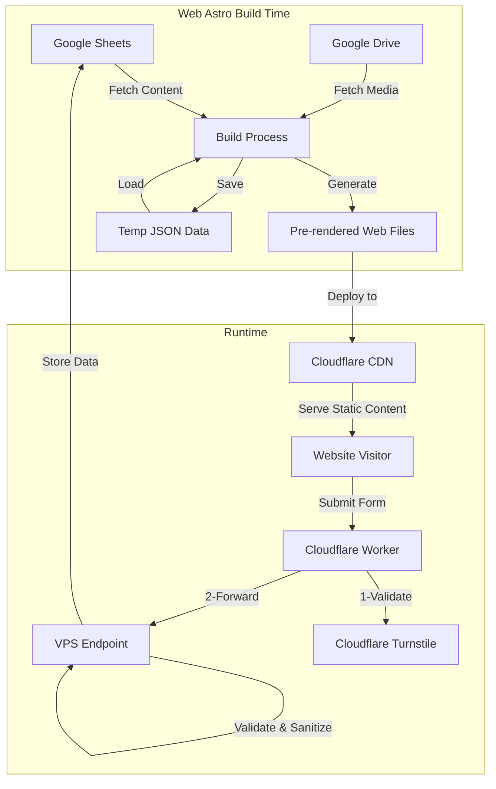

# WebGSheet
## A Modern Approach to Static Websites with Google Sheets as CMS

As a software engineer with decades of experience, I've seen countless approaches to content management systems (CMS) and website architectures. I'm excited to share a novel solution I've developed called WebGSheet—a powerful combination of static website generation and Google Sheets as a CMS. This approach offers minimal cost, exceptional performance, easy maintenance, and a massive potential for AI data processing and systems integration.

## The Genesis of WebGSheet

The challenge was clear: create a maintainable, high-performance website that non-technical users could easily update while keeping infrastructure costs low. The solution emerged from combining several modern technologies into a cohesive system that I've successfully implemented for [Finques Mozart](https://gestio-mozart.com).

## Core Architecture: Building on Modern Foundations

At the heart of WebGSheet lies a cost-effective architecture combining three powerful technologies, each chosen to create a seamless experience for developers and end-users.

The foundation of our solution is the **Astro web framework**, a modern approach to building websites that is gaining tremendous popularity in the development community. Astro creates lightning-fast websites that don't require complex backend servers by generating static pages at build time. It keeps the simplicity of a quasi-bare-bones framework with the power to add other tools and frameworks to solve every business problem. 

When managing content, I took an unconventional yet practical approach. Instead of building or deploying a traditional CMS, I turned to a tool that most people already know and love: **Google Sheets**. Think about it – how many hours have we spent teaching clients to use complex content management systems when they're already experts at spreadsheets? With Google Sheets as the CMS, content editors can work in a familiar environment, collaborate in real-time, and never worry about losing their changes, thanks to built-in version control. Better yet, they can leverage the full power of Google Workspace, connecting their website content to their existing business workflows without any additional hosting costs.

But what about dynamic features like form submissions? This is where **Cloudflare Workers** enter the picture, acting as clever intermediaries between your static site and any necessary backend processes. Like efficient postal workers, they ensure that form submissions are correctly handled, validated, and delivered to their destination while maintaining a static website's performance benefits.

## Form Submission Flow: Elegance in Motion

Let me explain what happens when a visitor fills out a form on a WebGSheet-powered site. It's like watching a well-choreographed dance, with each technology playing its part perfectly.

The journey begins right at the front end with Cloudflare Turnstile standing guard. Unlike traditional CAPTCHAs that make you squint at blurry text or hunt for traffic lights in grainy images, Turnstile works quietly in the background. It's like having a friendly bouncer who can spot troublemakers without hassling genuine guests. As a developer, I found it refreshingly simple to implement – just a few lines of code, and my forms were protected from bots and malicious submissions.

Once the form passes this first checkpoint, the real magic happens. The submitted data embarks on a carefully plotted journey through our serverless architecture. Cloudflare Workers catch the submission first, like skilled handlers in a relay race. They perform initial checks and sanitisation to ensure the data is clean and valid.

At this point, I ran into an interesting challenge. While Cloudflare Workers are powerful, they have limitations – particularly when using specific Node.js packages. The Google API packages I needed weren't directly supported in this environment. I could have tried some complex workarounds, but as any seasoned developer knows, sometimes the simplest solution is the most maintainable. So, I decided to add one more leg to our relay race: a lightweight API endpoint on my VPS that receives the data from the Workers and handles the final communication with Google Sheets.

### Real-World Implementation

To see this architecture in action, look no further than gestio-mozart.com. The site features two different types of forms, each with its validation requirements:

First, a straightforward contact form collects basic business information—the kind most websites need. It's simple but essential, like the foundation of a building.

Then, a more complex property management budget request form gathers detailed information about real estate properties, such as the number of residential units, commercial spaces, parking spots, and more. This form demonstrates how our approach can handle complex data collection needs without breaking a sweat.

Behind the scenes, both forms benefit from robust validation and sanitisation. While I won't bore you with the actual code here, imagine the typical validation rules that ensure email addresses look like email addresses, phone numbers contain only digits and proper formatting characters, and all inputs are thoroughly sanitised to prevent security issues. The sanitised HTML package does the heavy lifting here, stripping out any potentially dangerous HTML while preserving the legitimate content.

// Code note: Add form validation implementation using sanitize-html package
// Example: 
// - Email format validation
// - Phone number validation
// - Input sanitization

## Build and Deployment Process: Where the Magic Happens
Imagine your website as a gourmet meal prepared in advance and served instantly when guests arrive. That's essentially what happens during our build and deployment process—a carefully orchestrated series of steps that turns raw content into a polished, high-performance website.

The process begins with what I like to call the "gathering of ingredients." Before Astro can work magic, we must collect everything from Google's digital pantry. A pre-build script acts as our chef's assistant, fetching all the necessary data from the cloud and organising it neatly in a temporary assets folder. It pulls content from Google Sheets, downloads images and other media from Google Drive, and transforms spreadsheet data into JSON files that Astro can easily digest.

Behind the scenes, this Script leverages the power of Google's APIs through a few essential Node.js packages. While I will include the actual code below, consider using google-auth-library to handle authentication (like getting the keys to Google's pantry) and Google to retrieve the actual data (like selecting the specific ingredients we need). These packages make what could be a complex process surprisingly straightforward.

// Code note: Add Google Sheets API integration example
// Using google-auth-library and googleapis packages
// Core pre-build script code

Once the pre-build assistance assembles all our ingredients locally, Astro steps in as the master chef. It doesn't care where the data originated – it just sees local JSON files ready to be transformed. Astro processes these files, mixes them with templates, and "cooks" them into pre-rendered performant HTML pages. The beauty of this approach is that Astro can work at maximum efficiency without waiting for network requests or API responses.

But who delivers this gourmet meal to your users? That's where our CI/CD pipeline comes in – think of it as our dedicated delivery service. Whether triggered by a content update in Google Sheets or a code change in the repository, the pipeline springs into action automatically. It handles all the tedious work – installing dependencies, running the build process, and deploying the freshly generated files to the production server. Like a well-trained staff, it ensures that everything happens smoothly, without manual intervention.

The result? A website that's always up-to-date yet serves pages with the speed and efficiency of a static site. It's like having a restaurant that prepares everything in advance but still serves food that tastes freshly made – the best of both worlds.

## Advanced Features and Integration

The system's capabilities extend beyond basic content management:

1. **Custom Google Sheets Integration**
   - Custom menus and buttons for content editors
   - Automated workflows through Apps Script
   - Direct integration with internal systems

2. **Asset Management**
   Google Drive serves as a media library, with all assets pre-fetched during build time.

## Limitations and Considerations

While WebGSheet offers numerous advantages, it's essential to understand its limitations:

- Build times can extend to several minutes, especially with numerous images
- This solution is not suitable for websites requiring real-time updates
- CI/CD pipeline usage might incur costs for high-frequency updates

## Future Potential

The potential for expanding this system is significant, particularly in these areas:

1. **AI Integration**
   - Automated content optimisation
   - Image processing and optimisation
   - Smart form response handling

2. **Automation Opportunities**
   - Triggered builds based on the Google Sheets content changes
   - Automated content validation
   - Easy integration with business intelligence tools

## Conclusion

WebGSheet represents a pragmatic approach to website development that combines the best static site generation with the familiarity of Google Sheets. While not suitable for every use case, it offers an excellent solution for websites that:
- Need regular but not real-time updates
- Require a user-friendly content management interface
- Must maintain high performance
- Need to operate with minimal infrastructure costs

The success of https://gestio-mozart.com demonstrates that this approach is not just theoretical but practical and production-ready. As we continue to explore the possibilities of this architecture, the potential for AI integration and automation promises even more exciting developments in the future.

The next steps for gestio-mozart.com will be to implement all the real-state management using this WebGSheets approach. This will further stretch and validate how this novel architecture can solve real-world problems with an effective maintenance cost. 

Would you like to try WebGSheet for your next project? The source code will be available soon on GitHub, and I welcome contributions from the community.
