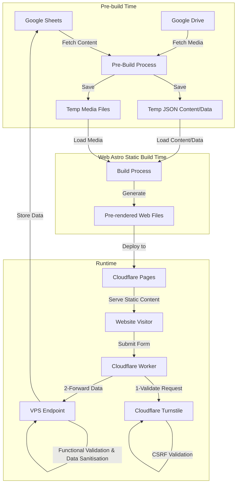
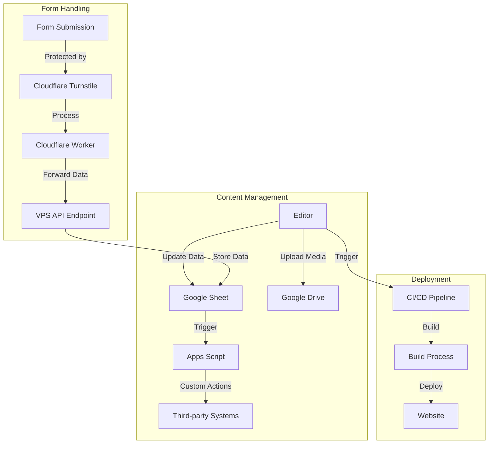

import { Image } from 'astro:assets';
import cloudflarePipelineImg from './_images/2025-02-21-webgsheets/pipeline-cf.png';


# WebGSheet
## A Modern Approach to Static Websites with Google Sheets as CMS

As a software engineer with decades of experience, I've seen countless approaches to content management systems (CMS) and website architectures. I'm excited to share a novel solution I've developed called WebGSheet—a powerful combination of static website generation and Google Sheets as a CMS. **This approach offers minimal cost, exceptional performance, easy maintenance, and a massive potential for AI data processing and systems integration.**

## The Genesis of WebGSheet

The challenge was clear: create a maintainable, high-performance website that non-technical users could easily update while keeping infrastructure costs low. The solution emerged from combining several modern technologies into a cohesive system that I've successfully implemented for [Finques Mozart](https://gestio-mozart.com).

## Core Architecture: Building on Modern Foundations

At the heart of WebGSheet lies a cost-effective architecture combining three powerful technologies, each chosen to create a seamless experience for developers and end-users.



The foundation of our solution is the **Astro web framework**, a modern approach to building websites that is gaining tremendous popularity in the development community. Astro creates lightning-fast websites that don't require complex backend servers by generating static pre-rendered pages at build time. It keeps the simplicity of a quasi-bare-bones framework with the power to add additional tools and UI frameworks to solve every business problem. 

When managing content, I took an unconventional yet practical approach. Instead of building or deploying a traditional CMS, I turned to a tool that most people already know and love: **Google Sheets**. Think about it – how many hours have we spent teaching clients to use complex content management systems when they're already experts at spreadsheets? With Google Sheets as the CMS, content editors can work in a familiar environment, collaborate in real-time, and never worry about losing their changes, thanks to built-in version control. Better yet, they can leverage the full power of Google Workspace, connecting their website content to their existing business workflows without any additional hosting costs.

But what about dynamic features like form submissions? This is where **Cloudflare Workers** enter the picture, acting as clever intermediaries between your static site and any necessary backend processes. Like efficient postal workers, they ensure that form submissions are correctly handled, validated, and delivered to their destination while maintaining a static website's performance benefits.

## Form Submission Flow: Elegance in Motion

Let me explain what happens when a visitor fills out a form on a WebGSheet-powered site. It's like watching a well-choreographed dance, with each technology playing its part perfectly.



The journey begins right at the front end with Cloudflare Turnstile standing guard. Unlike traditional CAPTCHAs that make you squint at blurry text or hunt for traffic lights in grainy images, Turnstile works quietly in the background. It's like having a friendly bouncer who can spot troublemakers without hassling genuine guests. As a developer, I found it refreshingly simple to implement – just a few lines of code, and my forms were protected from bots and malicious submissions.

Once the form passes this first checkpoint, the real magic happens. The submitted data embarks on a carefully plotted journey through our serverless architecture. Cloudflare Workers catch the submission first, like skilled handlers in a relay race. They perform preliminary data checks and CSRF validation to ensure the data submission is valid and safe to be processed. 

At this point, I ran into an interesting challenge. While Cloudflare Workers are powerful, they have limitations – particularly when using specific Node.js packages. The Google API packages I needed weren't directly supported in this environment. I could have tried some complex workarounds, but as any seasoned developer knows, sometimes the simplest solution is the most maintainable. So, I added one more leg to my relay race: a lightweight API endpoint on my VPS that receives the data from the Workers and handles the final communication with Google Sheets.

### Real-World Implementation

To see this architecture in action, look no further than Finques Mozart at https://gestio-mozart.com. The site features two different forms, each with its validation requirements:

First, a straightforward contact form collects basic business information—the kind most websites need. It's simple but essential, like the foundation of a building.

Then, a more complex property management budget request form gathers detailed information about real estate properties, such as the number of residential units, commercial spaces, parking spots, and more. This form demonstrates how our approach can handle complex data collection needs without breaking a sweat.

Behind the scenes, both forms benefit from robust validation and sanitisation. While I will bore you with the actual code below, for now, imagine the typical validation rules that ensure email addresses look like email addresses, phone numbers contain only digits and proper formatting characters, and all inputs are thoroughly sanitised to prevent security issues. The sanitised Nodejs package does the heavy lifting, stripping out any potentially dangerous HTML while preserving legitimate content.


Some code of the validation and sanitisation module:
```ts
import sanitized from "sanitized";
import { validate } from "deep-email-validator";
import { BadRequest, Forbidden, Unauthorized } from "@curveball/http-errors";

import envConfig from "./config";


const SANZT_FORM_CONFIG = {
    ALLOW_UNKNOWN_PROTOCOLS: false, // Disallow unknown protocols for URLs
    FORBID_TAGS: ["script", "iframe"], // Disallow specific tags that can execute scripts
    FORBID_ATTR: ["onclick", "onerror"], // Disallow event handler attributes
    //... more rules
    SAFE_FOR_TEMPLATES: true, // Allow safe template use
};

...
/**
 * Allows to sanitise all the JSON data recieved by the API endpoint.
 */
const sanitizeJsonData = (data: JSON) => {
    return sanitized(data, SANZT_FORM_CONFIG);
}

async function isValidEmail(emailAddress: string) {
    console.info('Validating email address ...')
    const validEmailCheck = await validate({
        email: emailAddress,
        validateSMTP: false,
    });
    if (!validEmailCheck.valid) {
        throw new BadRequest(`Not valid email ${emailAddress}, because: ${validEmailCheck.reason}`);
    }
}

const isValidRequest = async (request: Request): Promise<void> => {
    console.info('Authorizing request ...')
    const authHeader = request.headers.get('authorization');
    await validateAuthHeader(authHeader);
}

const validateAuthHeader = async (authHeader: string | null): Promise<Response | void> => {
    if (!authHeader) {
        throw new Unauthorized ();
    }

    const headerApiKey = authHeader.split(' ')[1];
    const validApiKey = envConfig.apiKey;
    if (headerApiKey !== validApiKey) {
        throw new Forbidden("Invalid API Key");
    }

    ...
}

export { filter_key_data, sanitizeJsonData, 
    isValidEmail, isValidRequest };

```

## Build and Deployment Process: Where the Magic Happens
Imagine your website as a gourmet meal prepared in advance and served instantly when guests arrive. That's essentially what happens during our build and deployment process—a carefully orchestrated series of steps that turns raw content into a polished, high-performance website.

The process begins with what I like to call the "gathering of ingredients." Before Astro can work magic, we must collect everything from Google's digital pantry. A pre-build script acts as our chef's assistant, fetching all the necessary data from the cloud and organising it neatly in a temporary assets folder. It pulls content from Google Sheets, downloads images and other media from Google Drive, and transforms spreadsheet data into JSON files that Astro can easily digest. In the case of Finques Mozart, I needed to fetch and prepare all the images and data related to the real state page with the list of properties; this part is still under review before I can publish the whole side.

Behind the scenes, this Script leverages the power of Google's APIs through a few essential Node.js packages. While I will include the actual code below, consider using google-auth-library to handle authentication (like getting the keys to Google's pantry) and Google to retrieve the actual data (like selecting the specific ingredients we need). These packages make what could be a complex process surprisingly straightforward.

The prebuild script to prepare the ingredients:
```ts
import { authenticate } from './src/lib/auth.ts';
import { preparePropertyImages } from './src/lib/fotos.ts';
import { syncRemotePropertiesData } from './src/lib/finques.ts';

function getEnvVariable(name: string): string {
    const value = process.env[name];
    if (!value) {
        throw new Error(`Missing environment variable: ${name}`);
    }
    return value;
}


async function runPrebuild() {
    try {
        console.log('Executing prebuild script...');
        const google_sheet_id = getEnvVariable("GOOGLE_SHEETS_ID");
        const google_sheet_range = getEnvVariable("READ_GOOGLE_SHEETS_RANGE");
        const googleDriveConfig = {
            credentials: getEnvVariable("GOOGLE_SERVICE_ACCOUNT_JSON"),
            scopes: ["https://www.googleapis.com/auth/drive.readonly",
                "https://www.googleapis.com/auth/spreadsheets"],
        }

        const auth = await authenticate(googleDriveConfig);
        if (auth) {
            await preparePropertyImages(auth);
            await syncRemotePropertiesData(auth, google_sheet_id, google_sheet_range);
            console.log('Prebuild script executed successfully.');
        } else {
            console.log('Authentication failed.')
        }
    } catch (error) {
        console.error('Error executing prebuild script:', error);
        process.exit(1);
    }
}

runPrebuild();

```
Once the pre-build assistance assembles all our ingredients locally, Astro steps in as the master chef. It doesn't care where the data originated—it just sees local files ready to be transformed. Astro processes these files, mixes them with templates, and "cooks" them into pre-rendered performant HTML pages. The beauty of this approach is that Astro can work at maximum efficiency without waiting for network requests or API responses to build the static website.

But who delivers this gourmet meal to your users? That's where our CI/CD pipeline comes in - think of it as our dedicated delivery service. Whether triggered by a content update in Google Sheets or a code change in the repository, the pipeline springs into action automatically. It handles all the tedious work - installing dependencies, running the build process, and deploying the freshly generated files to the production server. Like a well-trained staff, it ensures that everything happens smoothly, without manual intervention.

For the Finques Mozart case, I used the pipeline integrated into the Cloudflare Pages solution. Cloudflare pages are one of the most straightforward solutions for publishing a static website. In this case, I only needed to set up the build command as **'pnpm build'** and the destination folder **'/dist'** for Astro.

<Image class="rounded-md m-0 w-full object-contain" src={cloudflarePipelineImg} 
            alt="Cloudflare configuration pipeline screenshot" format="avif" />

The result? A website that's always up-to-date yet serves pages with the speed and efficiency of a static site. It's like having a restaurant that prepares everything in advance but still serves food that tastes fresh made daily – the best of both worlds.

## Advanced Features and Integration: Where Automation Meets Real Business Needs

Let me share a story that perfectly illustrates the power of WebGSheet's advanced features. At Finques Mozart, property management isn't just about collecting form submissions – it's about transforming those submissions into actionable business processes. This step is where the magic of Google Sheets integration shines.

Picture this: A potential client fills out a detailed budget request form on the website. The data lands neatly in a Google Sheet, but that's the beginning. The property managers at Finques Mozart don't want to copy and paste this information manually into their standard forms. Instead, they open a custom menu I built into their Google Sheets – think of it as their personal command centre. They select the relevant budget request with a few clicks, and voilà! A professionally formatted PDF appears in their Google Drive, ready for printing and processing.

This automation might seem simple, but it's transformative for daily operations. The beauty of this approach is that we're just scratching the surface. The same principles could be applied to automatically:
- Generate budget request drafts
- Generate contracts
- Send client notifications
- Update internal databases
- Trigger workflow processes
- Integration with accounting systems

This is the main part of the App Script:
```js
function onOpen() {
  SpreadsheetApp.getUi()
    .createMenu('Custom Menu')
    .addItem('Export budget request', 'getRowNumberAndExport')
    .addToUi();
}

function getRowNumberAndExport() {
  const ui = SpreadsheetApp.getUi();
  const result = ui.prompt(
    'Enter the row number',
    'Please enter the row number of the budget request:',
    ui.ButtonSet.OK_CANCEL);

  if (result.getSelectedButton() == ui.Button.OK) {
    const rowNumber = parseInt(result.getResponseText());
    if (!isNaN(rowNumber)) {
      exportRowToPDF(rowNumber);
    } else {
      ui.alert('Number not valid.');
    }
  }
}

function exportRowToPDF(rowNumber) {
  const ss = SpreadsheetApp.getActiveSpreadsheet();
  const budgetSheet = ss.getSheetByName("Budgets")
  const budgetCardTemplate = ss.getSheetByName("BudgetCard");

  ss.toast('Loading budget request ' + rowNumber, APP_TITLE, 1);
  const budget = dataRowObject(budgetSheet, rowNumber);

  ss.toast('Creating budget request card ', APP_TITLE, 1);
  cleanFitxa(budgetCardTemplate);
  budgetCardTemplate.getRange('B3').setValue(budget.data);
  budgetCardTemplate.getRange('B4').setValue(budget.nom);
  budgetCardTemplate.getRange('B5').setValue(budget.email);
  budgetCardTemplate.getRange('B6').setValue(budget.tel_fon);
  budgetCardTemplate.getRange('B7').setValue(budget.direcci_);
  budgetCardTemplate.getRange('B8').setValue(budget.n_v);
  budgetCardTemplate.getRange('B9').setValue(budget.n_p_p);
  budgetCardTemplate.getRange('B10').setValue(budget.n_l_c);
  budgetCardTemplate.getRange('B11').setValue(budget.n_t);
  budgetCardTemplate.getRange('B12').setValue(budget.comentaris);
  budgetCardTemplate.getRange('B13').setValue(budget.concentiment=='true'?'Si':'No');

  SpreadsheetApp.flush();
  Utilities.sleep(500); // Using to offset any potential latency in creating .pdf
  const pdf = createPDF(ss.getId(), budgetCardTemplate, `Fitxa ${rowNumber} - ${budget.nom}`);
  cleanFitxa(budgetCardTemplate);
  ss.toast('Card budget'+rowNumber+ ' created at '+pdf.getName(), APP_TITLE, 5);
}

function cleanFitxa(budgetCardTemplate){
  budgetCardTemplate.getRange(3, 2, 11, 1).clearContent();
}
...
```

Think of Google Sheets as an orchestra conductor, coordinating various business processes with perfect timing and precision.

However, this show has another star: asset management through Google Drive. Instead of wrestling with complex media management systems or worrying about backup solutions, we're leveraging Google's robust infrastructure. Every image, document, and video live safely in Google Drive, backed by one of the most reliable cloud systems in the world.

During the build process, our pre-build script acts like a meticulous librarian, gathering and organising all these assets perfectly. Then Astro steps in as the expert curator, optimising each image and asset for web delivery. The result? A website that loads quickly and efficiently, with all media perfectly optimised for your visitors.

Sample code of the "fotos" module to prepare the G.Driver assets into a local temporal folder:
```ts
import fs from "fs";

import { drive_v3, google, Auth } from "googleapis";

type ImageData = { path: string, id: string };

const localApiFotorsFolder = "./src/assets/images/api";

// Fetch all the images from the Google Drive visible to the service account.
async function fetchRemoteImagesData(drive: drive_v3.Drive): Promise<drive_v3.Schema$File[]> {
    try {
        const response = await drive.files.list({
            q: "mimeType='image/jpeg' or mimeType='image/png'",
            fields: "files(id, name)",
        });
        if (!response.data.files) {
            console.log("No files found.");
        } else {
            return response.data.files;
        }
    } catch (error) {
        console.error("Error fetching images:", error);
    }
    return [];
}

async function getFilePath(fileId: string, drive: drive_v3.Drive) {
    let path: string[] = [];

    async function fetchParentFolders(currentId: string) {
        const file = await drive.files.get({
            fileId: currentId,
            fields: "id, name, parents",
        });

        if (file.data.parents) {
            const parentId = file.data.parents[0];
            if (file.data.name) {
                path.push(file.data.name);
            }
            await fetchParentFolders(parentId);
        } else {
            if (file.data.name) {
                path.push(file.data.name);
            }
        }
    }
    await fetchParentFolders(fileId);
    return path.reverse().join("_");
}

async function downloadFile(fileId: string, filePath: string, drive: drive_v3.Drive) {
    const dest = fs.createWriteStream(filePath);

    console.log(`Downloading image... to dest: ${dest.path}`);
    const res = await drive.files.get({
            fileId: fileId,
            alt: "media",
        },{ responseType: "stream" }
    );

    res.data
        .on("end", () => {
            console.log(`Downloaded ${filePath}`);
        })
        .on("error", (err) => {
            console.error("Error downloading file:", err);
        })
        .pipe(dest);

    return res.data;
}

function openDriveConnection(auth: Auth.OAuth2Client) {
    return google.drive({ version: "v3", auth });
}


const getSortedImagePaths = async (remoteData: drive_v3.Schema$File[], drive: drive_v3.Drive):
    Promise<ImageData[]> => {
    const imagePaths = await Promise.all(
        remoteData?.map(async (file) => {
            const filePath = await getFilePath(file.id!, drive);
            return { path: filePath, id: file.id };
        }) || []
    );
    const filteredImagePaths = imagePaths.filter(file => file.id !== undefined && file.id !== null) as ImageData[];
    return filteredImagePaths.sort((a, b) => a.path.localeCompare(b.path));
}

const downloadAllImages = (imagePaths: ImageData[], drive: drive_v3.Drive) => {
    for (const image of imagePaths) {
        const fullPath = `${localApiFotorsFolder}/${image.path}`;
        if (image.id && !fs.existsSync(fullPath)) {
            downloadFile(image.id, fullPath, drive);
        } else {
            console.log(`Skipping download for ${image.path}`);
        }
    }
}

const preparePropertyImages = async (auth: Auth.OAuth2Client): Promise<ImageData[]> => {
    console.log("Downloading images...");
    const drive = openDriveConnection(auth);
    const remoteData = await fetchRemoteImagesData(drive);
    const sortedImagePaths = await getSortedImagePaths(remoteData, drive);
    downloadAllImages(sortedImagePaths, drive);
    console.log("Images downloaded successfully");
    fs.writeFileSync("./src/data/imagesData.json", JSON.stringify(sortedImagePaths, null, 2));
    console.log("Images data saved to imagesData.json");
    return sortedImagePaths;
}

export { preparePropertyImages };

```

The real power here isn't just in what we've built—it's in what's possible. Every Google Sheet can become a command center for business automation, and every Drive folder can be a perfectly organised media library. The potential for integration with other systems is limited only by our imagination.

## The Road Less Traveled: WebGSheet's Boundaries

As with any pioneering solution, my journey with WebGSheet hasn't been without its challenges. I remember deploying a WebGSheet solution for a marketing team last year and watching them marvel at its simplicity—until we hit our first roadblock.

"Why is it taking so long to update?" their lead asked as we waited for a build with dozens of high-resolution product images. That day taught us an important lesson: patience becomes necessary when building times that stretch into minutes rather than seconds.

Another revealing moment came during a client presentation when a stakeholder asked, "Can we use this for our live event dashboard?" I had to explain that WebGSheet shines brightest as a static solution—asking it to handle real-time updates is like asking a librarian to announce breaking news.

The financial landscape will also require careful navigation. A startup might discover this challenge when their enthusiastic development team implements frequent daily updates, only to receive an unexpected cloud services bill at month's end. Their CI/CD pipeline could quietly accumulate costs with each build, turning what seemed like an economical solution into a more expensive proposition than initially anticipated. Even though we might add many changes and other optimisations to the build process, this solution would not be a good fit for a website that requires constant daily updates by the minute. 

Despite these boundaries, WebGSheet remains a hidden gem for organisations with modest requirements and limited technical resources. It's like finding a secret shortcut that bypasses the usual tollways of web development—perfect for the journey, provided you're not in a desperate hurry and don't need to make frequent stops along the way.

This approach may not yet be charted on the mainstream technology roadmap, and we're still collecting traveller reviews. But for adventurous teams willing to explore new territory without venturing too far from safety, the risk-to-reward ratio makes this path particularly enticing.

Some potential build time optimisations that we could implement:
- Use image compression before uploading to spreadsheets
- Implement selective builds that only regenerate changed sections
- Schedule builds during off-hours for content that doesn't need immediate publishing

## Charting New Horizons: WebGSheet's Untapped Potential

As I gaze into WebGSheet's future, I see a landscape rich with possibilities waiting to be explored. Like a frontier town on the edge of expanding territory, my current implementation is just the beginning of what could become a thriving ecosystem.

Imagine a world where artificial intelligence becomes your silent partner in content creation. Much like how a seasoned editor refines your work, AI could analyse your spreadsheet content and suggest optimisations to improve engagement and readability. Those product images you've painstakingly selected? AI could automatically process them, adjusting sizes and formats for optimal loading times without you lifting a finger. Even those customer feedback forms could become more innovative, with AI helping to categorise responses and highlight actionable insights before they ever reach your inbox.

We could manage the website's copy and content from a Google Sheet, making it easy to update any text, image, or asset on the website. 
 
Future AI implementation could leverage:
- Natural language processing APIs for content analysis
- Image recognition services that automatically tag and optimise visuals
- Sentiment analysis for form responses to prioritise urgent customer needs

The automation horizon appears equally promising. Picture a system so intuitive that it detects when you've made significant changes to your spreadsheet and asks the user to launch a new build automatically—minimum manual triggers required. Content validation could evolve beyond simple formatting checks to ensure brand consistency and accessibility compliance across your site. 

Imagine seamlessly feeding your spreadsheet data into your favourite business intelligence dashboards, creating a continuous flow of insights without complex integration work.

Potential automation triggers could include:
- Google Sheets API webhooks to monitor specific ranges for changes
- Scheduled validation scripts that check content against predefined rules
- Data connectors that transform spreadsheet data into formats compatible with BI tools
- Leveraging the AI model Gemini in your Google Sheets.

This vision isn't just about adding features—it's about transforming a simple tool into an intelligent platform that anticipates needs and solves problems before they arise. While today's WebGSheet might be your web presence's quiet, reliable workhorse, tomorrow's version could become the strategic partner that helps your content truly connect with your audience.

The journey from spreadsheet to sophisticated automated AI experience is just beginning, and these unexplored pathways represent not just technological advancements but also new ways to examine web interfaces for teams of all sizes and technical capabilities.

## Conclusion

WebGSheet represents a pragmatic approach to website development that combines the best static site generation with the familiarity of Google Sheets.

While not suitable for every use case, it offers an excellent solution for websites that:
- Need regular but not real-time updates.
- Require a user-friendly content management interface.
- Must maintain high performance.
- Need to operate with minimal infrastructure costs.

The success of Finques Mozart demonstrates that this approach is not just theoretical but practical and production-ready. By empowering non-technical stakeholders to manage content directly, we've eliminated development bottlenecks while maintaining the performance benefits of static generation. The separation of concerns between content and presentation has resulted in a more maintainable codebase and more explicit workflows for all team members.

As we continue to explore this architecture's possibilities, the potential for AI integration and automation promises even more exciting developments in the future. The combination of accessibility, performance, and scalability makes this approach particularly valuable for organisations with limited technical resources but ambitious web presence goals.

The next step for Finques Mozart will be implementing all the real-estate management systems using this WebGSheets approach. This will be a challenging and fun adventure, further proving how this novel architecture can solve real-world problems with an effective maintenance cost. The planned expansion will include property listing management, client relationship tracking, and automated reporting systems—all managed through familiar spreadsheet interfaces and Google Drive capabilities.

Would you like to try WebGSheet for your next project? The source code will soon be available on GitHub under an open-source license, allowing you to adapt and extend it for your specific needs. Meanwhile you can also ask me directly for more code samples or implementation guidance. I welcome constructive feedback and contributions from the community as I continue to refine and expand this innovative approach to web development.

Remember: sometimes, the most elegant solutions aren't about adopting the latest framework but about thoughtfully combining established technologies to solve real problems for real users.

------
Many thanks for reading, please leave a comment if you have any quality hint.

Keep on living, better!

