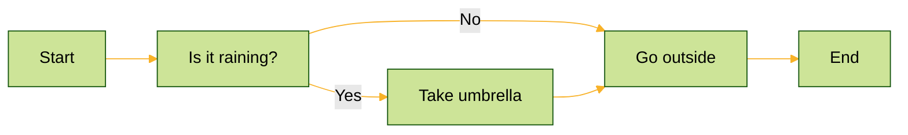

## Executive Summary
Building a blog with Astro and MDX is an excellent way to create a modern, content-rich static site, but adding Mermaid diagrams introduces unexpected complexity. This blog post explores the challenges of integrating Mermaid diagrams into an Astro MDX blog and presents a streamlined solution using a custom devContainer setup with Docker Compose. By leveraging a pre-configured Docker image that includes all necessary dependencies, like Playwright-core and Chrome, for diagram generation, this approach simplifies the setup process, ensures consistency across environments, and enhances the development experience.

## TL;DR
* Complex Setup: Integrating Mermaid diagrams into an Astro MDX blog requires specific configurations that aren't straightforward.
* Custom devContainer: A Docker Compose-based devContainer with a tailored Docker image provides a pre-configured, reproducible environment.
* Key Tools: The solution involves installing the required packages and using Playwright-core with Chrome to generate static Mermaid diagrams during the build.

## Introduction to Mermaid Diagrams
Mermaid Diagrams represent a significant advancement in diagramming for engineering blogs, offering a text-based approach to creating visual representations. They are defined using a syntax inspired by Markdown, which the browser can render into flowcharts, sequence diagrams, and entity-relationship diagrams via JavaScript. This method facilitates ease of editing, version control, and collaboration, addressing the common issue of outdated documentation.

The rendering process begins with the user defining the diagram using text-based syntax. For instance, a flowchart written as:



A JavaScript library can interpret and render this text into a visual diagram. This rendering can be integrated into web pages, documentation tools, or platforms supporting JavaScript, enhancing the visual storytelling within technical content.
<br/>

## The Main Problem
Astro is a powerful static site generator, and MDX extends Markdown with JSX, enabling dynamic components in your blog posts. However, **the integration isn't as simple as dropping Mermaid code into your MDX files and calling it a day.**

Mermaid diagrams are typically rendered client-side in the browser using JavaScript, which works fine for dynamic sites. However, client-side rendering can hurt performance and SEO for a static site like an Astro blog, as search engines may not fully process the diagrams. Pre-rendering the diagrams into static assets (like images or SVGs) during the build process is a more efficient approach, and this requires server-side rendering capabilities that Astro and MDX don't natively provide straightforwardly. 

Any post or tutorial I found online required the installation of more packages and tools that I did not want to install on my host machine. I always minimise the installation of more dev packages, tools, or apps on my local machine to keep it cleaner, safer, and more performant; thus, I leverage the potential of devContainer and Docker.

**The challenges boil down to a Dependency Management:** At build time, Astro will need the libs and tools that Mermaid usually expects in a browser environment.
Custom configuration: Rendering Mermaid diagrams server-side during the build process demands additional setup beyond what Astro offers by default.
Environment Consistency: We must generate those diagrams from the local dev, CI/CD pipelines and deployment pipelines on any dev environment.
<br/>

## The Solution
**I've developed a custom Docker image to tackle these challenges and create a consistent, reproducible environment.** This solution encapsulates all the necessary dependencies and tools, making it easy to build the Astro MDX blog and seamlessly embed pre-rendered Mermaid diagrams.

Then, I can use the same docker image for a local devContainer development environment and for the CI/CD pipelines.


The full implementation is in my marcandreuf.com website public repo, with the Docker configuration detailed in this Docker file.

### Here's how it works:
1. Docker Image Configuration
The foundation of this solution is a custom Docker image built from a Dockerfile. This image includes:
Core Dependencies are Node.js, Astro, MDX, and Mermaid-related packages, which ensure the blog can process Markdown and render static pages.
Diagram Rendering Tools: Playwright-core and Chrome are critical for generating Mermaid diagrams server-side (more on this below).

> The setup eliminates the need for developers to manually configure their local machines by pre-installing these dependencies in the Docker image.

2. Essential Packages and Astro Configuration

Specific npm packages and configuration tweaks are required for Mermaid diagrams to integrate smoothly with Astro and MDX. Drawing from this excellent guide, I've incorporated the following into the Docker image:

**Packages & Config:**
* **rehype-mermaid:** A rehype plugin that processes Mermaid code blocks in MDX files during the build process.
* **playwright-core:** Facilitates browser automation for server-side diagram rendering.
* **Astro Configuration:** The `astro.config.mjs` file is updated to include the MDX integration and the `rehype-mermaid` plugin, ensuring Mermaid diagrams are rendered as part of the static site generation. Here's an example configuration:

``` js
# markdown mermaid plugin in the astro.config.mjs

export default defineConfig({
  site: SITE_URL,
  ...
  markdown: { 
    remarkPlugins,
    rehypePlugins: [rehypeMermaid],
  },
  ...
});


```

> This configuration instructs Astro to process MDX files and use `rehype-mermaid` to convert Mermaid code blocks into rendered diagrams during the build.

3. Playwright-core and Chrome for Diagram Generation. A standout feature of this solution is the use of Playwright-core with Chrome to render Mermaid diagrams at build time. Here's why this matters:
Playwright-core: This lightweight library provides programmatic control over browsers like Chrome, enabling automated rendering tasks.
Chrome Integration: Chrome is the rendering engine where Playwright-core transforms Mermaid's text-based definitions into static assets (e.g., PNGs or SVGs).
Build-Time Execution: Custom build scripts generate these assets using Playwright-core, which are then embedded into the MDX pages before Astro compiles the site.

> This server-side rendering approach ensures diagrams are pre-rendered and optimised, boosting page load performance and SEO.

4. devContainer and Docker Compose. The devContainer setup ties everything together:
* **Isolation and Reproducibility:** The Docker Compose configuration defines the services and environment, ensuring consistency across all development and SDLC stages.
* **Tooling Integration:** With tools like Visual Studio Code and the Remote - Containers extension, you can open the project directly in the containerised environment, ready to code.

5. Build Process
During the build:
Scripts scan MDX files for Mermaid code blocks.
Playwright-core renders these diagrams into static files.
Astro processes the MDX pages, embedding the generated diagram assets into the final static site.

This streamlined workflow eliminates manual rendering steps and ensures diagrams are consistently included in the Astro build output.

**The Dockerfile is central to this setup**, as it installs all required packages and configures the environment. The repository offers a working example you can clone and adapt.

```dockerfile
FROM node:22-bookworm

RUN apt update && apt upgrade -y && \
    apt-get install -y\
    sudo\
    libnss3\
    libnspr4\
    libdbus-1-3\
    libatk1.0-0\
    libatk-bridge2.0-0\
    libcups2\
    libxcomposite1\
    libxdamage1\
    libxfixes3\
    libxrandr2\
    libgbm1\
    libxkbcommon0\
    libasound2\
    libatspi2.0-0 && \
    apt clean && \
    rm -rf /var/lib/apt/lists/*

SHELL ["/bin/bash", "-c"]

RUN npm install -g npm@latest && \
    npm install -g pnpm && \
    pnpm --version

# Adding node to sudoers to make locla dev en more flexible for tesing new configurations.
RUN adduser node sudo
RUN echo '%sudo ALL=(ALL) NOPASSWD:ALL' >> /etc/sudoers

USER node

RUN mkdir -p /home/node/.ssh && \
    ssh-keyscan github.com >> /home/node/.ssh/known_hosts

RUN export SHELL="bash" && pnpm setup

ENV PNPM_HOME="/home/node/.local/share/pnpm"
ENV PATH="${PNPM_HOME}:${PATH}"

RUN SHELL="bash" && \
    pnpm config set store-dir "${PNPM_HOME}/store" && \
    pnpm install -g typescript && \
    pnpm self-update && \
    pnpm --version && tsc --version

# Required for mdx mermaid diagrams rendering    
RUN pnpx playwright-core install chromium
    
WORKDIR /home/node/workspace

CMD [ "node" ]

```

## Conclusion
Integrating Mermaid diagrams into an Astro MDX blog unlocks powerful visualisation capabilities for technical content, but the setup hurdles can be daunting. 

**My custom devContainer solution, powered by Docker Compose and a pre-configured Docker image, cuts through the complexity. This approach delivers a consistent, efficient development experience by bundling all dependencies for the server-side build time.**

Whether you're a solo developer or part of a team, this setup saves time and reduces frustration. Check out the repo to get started with the Astro MDX and Mermaid diagrams today!

------
Many thanks for reading, please leave a comment if you have any quality hint.

Keep on living, better!

