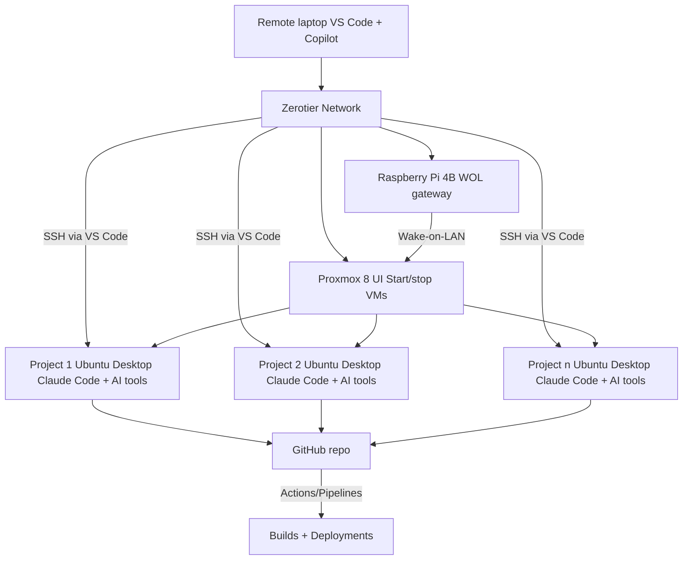

## Introduction

This post outlines my AI-driven home lab setup: Proxmox 8 hosting Ubuntu desktop VMs, scripts for VNC automation and cleanup, and a Raspberry Pi 4B Wake-on-LAN flow to power on the server remotely over Zerotier. Wait, what? Let me explain.

## Scenario: The Modern Dev Engineer's Home Lab

Imagine having a team of colleagues, each dedicated to working on a specific project, while you as a developer simply monitor and guide them to accomplish any development task. In my setup, Proxmox 8 enables this by providing dedicated Ubuntu desktop VMs for each project or client, creating a flexible and agentic environment where you can orchestrate and oversee all work efficiently. This setup offers:

With this infrastructure, I define custom tasks using a template that lets AI tools work on specific goals. This agentic approach means tasks can be distributed and executed in parallel, maximizing throughput and minimizing bottlenecks.

In practice, that means I can let Claude Code work on Project 1 while I test, review, and prompt the next tasks for Project 2 (and beyond) without waiting for any single workflow to finish.

## Seamless Remote Connectivity with Zerotier

To ensure I can work from anywhere and at any time, I use Zerotier to connect remotely to all my VMs. That includes working from other offices or cafés while I rely primarily on my home lab resources. Zerotier provides secure, flexible networking, allowing me to access my agentic development environments no matter where I am. From the Proxmox UI, I can start and stop individual VMs—and even shut down the Proxmox host itself—whenever I need. This means I can always reconnect to my distributed dev agents, check the status of each long-running task, and take action on the next steps without interruption, well, except when I sleep.

This is also an asynchronous setup: I can connect or disconnect via VNC at any time while Claude Code instances keep working and tests continue running. That flexibility gives me the freedom to drop in, review progress, and move on—without being tied to a single machine or schedule.

This flexibility is critical for modern workflows, especially when tasks require extended runtimes or when collaboration and monitoring need to happen across locations and time zones. Zerotier makes it easy to maintain continuity and productivity, keeping my home lab accessible and responsive.



## Leveraging AI Tools in a Distributed Setup

AI tools are integrated into each VM, handling everything from code generation to data analysis. I mainly run Claude Code inside the VMs and use Copilot in VS Code on my workstation, but the setup is flexible enough to support any AI tooling you prefer. From a security perspective, I keep AI off my personal computer and production servers; I only grant deeper OS access inside dev VMs (or, at most, test environments) so I can move fast without exposing sensitive systems. In those VMs, Claude Code has near full OS access via MCP tools (including the Chrome browser), which enables long test-and-fix loops without my intervention. By distributing workloads across multiple VMs, I can:

- Run experiments and builds in parallel
- Assign specialized agents to different projects
- Automate repetitive tasks and focus on creative problem-solving

This agentic, parallelized workflow is ideal for modern dev engineers who want to:

- Prototype quickly
- Iterate on solutions
- Deliver results efficiently

## Wake-on-LAN for Proxmox via Raspberry Pi 4B

My latest addition is a Raspberry Pi 4B that handles Wake-on-LAN for the Proxmox host using `wol-proxmox.sh`. It’s a convenience trick that lets me shut the lab down at night, on weekends, or during holidays, then bring it back up from anywhere with a single SSH command like `ssh ubuntu@192.168.192.21 './wol-proxmox.sh'`. Because all devices live on the same Zerotier network, it’s a straightforward setup—no port forwarding, no router changes, and none of the usual networking headaches. It’s a small upgrade that makes spinning up the lab on-demand fast and reliable.

## Sharing My Scripts: VNC Connections and Wake-on-LAN

To make remote access and management easier, I rely on a few small scripts from this repo. `connect-vnc.sh` handles the VNC tunnel and session setup so I can jump into any project VM quickly, while `wol-proxmox.sh` lets me power on the Proxmox host remotely before I connect. Both scripts are simple, effective, and easy to adapt to similar home lab setups.

### wol-proxmox.sh

```bash
#!/bin/bash
# start-server.sh - Wake on LAN script for Proxmox server

# Prevent locale warnings when running via SSH
export LC_ALL=C.UTF-8

MAC="xx:xx:xx:xx:xx:xx"  # Replace with your enp9s0 MAC from `cat /sys/class/net/enp9s0/address`
BROADCAST="192.168.219.255"

echo "Sending magic packet to $BROADCAST:9 with $MAC"

wakeonlan -i $BROADCAST $MAC

if [ $? -eq 0 ]; then
	echo "✓ Magic packet sent successfully"
else
	echo "✗ Failed to send magic packet"
fi
```

### connect-vnc.sh

```bash
#!/bin/bash

# connect-vnc.sh: Connect to a remote VNC session via SSH tunnel
#
# Usage:
#   ./connect-vnc.sh <HOST_IP> [USER] [LOCAL_PORT] [REMOTE_PORT] [VNC_DISPLAY] [--restart]
#
# Parameters:
#   HOST_IP      - Remote host IP address (required)
#   USER         - SSH username (default: ubdesk1)
#   LOCAL_PORT   - Local port for tunnel (default: 59003)
#   REMOTE_PORT  - Remote VNC port (default: 5901)
#   VNC_DISPLAY  - VNC display number (default: 1)
#   --restart    - (Optional) Restart the VNC server on the remote host. WARNING: This will kill all running apps in the VNC session!
#
# Examples:
#   ./connect-vnc.sh 192.168.1.100
#   ./connect-vnc.sh 192.168.1.100 myuser 59004 5902 2
#   ./connect-vnc.sh 192.168.1.100 myuser 59003 5901 1 --restart
#
# Notes:
# - By default, the script will connect to an existing VNC session if available, preserving all running apps.
# - Use --restart only if you need to reset the VNC session (e.g., authentication issues). This will terminate all running processes in the session.

# Default values
DEFAULT_USER="ubdesk1"
DEFAULT_LOCAL_PORT=59003
DEFAULT_REMOTE_PORT=5901
DEFAULT_VNC_DISPLAY=1

# Function to show usage
show_usage() {
	echo "Usage: $0 <HOST_IP> [USER] [LOCAL_PORT] [REMOTE_PORT] [VNC_DISPLAY]"
	echo ""
	echo "Parameters:"
	echo "  HOST_IP      - Remote host IP address (required)"
	echo "  USER         - SSH username (default: $DEFAULT_USER)"
	echo "  LOCAL_PORT   - Local port for tunnel (default: $DEFAULT_LOCAL_PORT)"
	echo "  REMOTE_PORT  - Remote VNC port (default: $DEFAULT_REMOTE_PORT)"
	echo "  VNC_DISPLAY  - VNC display number (default: $DEFAULT_VNC_DISPLAY)"
	echo ""
	echo "Examples:"
	echo "  $0 192.168.1.100"
	echo "  $0 192.168.1.100 myuser 59004 5902 2"
}

# Function to cleanup on exit
cleanup() {
	echo "Cleaning up..."

	# Kill SSH tunnel
	if [[ -n "$SSH_PID" ]] && kill -0 "$SSH_PID" 2>/dev/null; then
		echo "Killing SSH tunnel (PID: $SSH_PID)"
		kill "$SSH_PID" 2>/dev/null
		sleep 2
		# Force kill if still running
		if kill -0 "$SSH_PID" 2>/dev/null; then
			kill -9 "$SSH_PID" 2>/dev/null
		fi
	fi

	# Kill any remaining SSH tunnels on this port
	cleanup_local_port

	exit 0
}

# Function to clean up local port
cleanup_local_port() {
	echo "Checking for processes using local port $LOCAL_PORT..."
	local pids=$(lsof -t -i:"$LOCAL_PORT" 2>/dev/null)
	if [[ -n "$pids" ]]; then
		echo "Killing processes on port $LOCAL_PORT: $pids"
		echo "$pids" | xargs kill -TERM 2>/dev/null || true
		sleep 2
		# Force kill any remaining
		local remaining_pids=$(lsof -t -i:"$LOCAL_PORT" 2>/dev/null)
		if [[ -n "$remaining_pids" ]]; then
			echo "Force killing remaining processes: $remaining_pids"
			echo "$remaining_pids" | xargs kill -9 2>/dev/null || true
		fi
	fi
}

# Function to restart VNC server
restart_vnc_server() {
	echo "Restarting VNC server on display :$VNC_DISPLAY..."

	# Kill existing VNC server
	ssh "$USER@$HOST_IP" "vncserver -kill :$VNC_DISPLAY" 2>/dev/null || true
	sleep 2

	# Force kill if still running
	ssh "$USER@$HOST_IP" "pkill -f 'Xvnc.*:$VNC_DISPLAY'" 2>/dev/null || true
	sleep 1

	# Start VNC server
	echo "Starting fresh VNC server..."
	VNC_START_OUTPUT=$(ssh -t "$USER@$HOST_IP" "vncserver :$VNC_DISPLAY -localhost no" 2>&1)

	if [[ $? -eq 0 ]]; then
		echo "VNC server restarted successfully"
		return 0
	else
		echo "Error restarting VNC server:"
		echo "$VNC_START_OUTPUT"
		return 1
	fi
}

# Function to handle VNC connection with retry logic
connect_vnc_with_retry() {
	local max_attempts=3
	local attempt=1

	while [[ $attempt -le $max_attempts ]]; do
		echo "VNC connection attempt $attempt/$max_attempts"

		# Verify tunnel is still working
		if ! nc -z localhost "$LOCAL_PORT" 2>/dev/null; then
			echo "SSH tunnel is down, re-establishing..."
			if ! establish_ssh_tunnel; then
				echo "Failed to re-establish SSH tunnel"
				return 1
			fi
		fi

		# Start VNC viewer
		if command -v vncviewer >/dev/null 2>&1; then
			echo "Starting VNC viewer on localhost::$LOCAL_PORT"
			vncviewer "localhost::$LOCAL_PORT" 2>/dev/null
			vnc_exit_code=$?

			if [[ $vnc_exit_code -eq 0 ]]; then
				echo "VNC session ended normally"
				return 0
			fi

			echo "VNC viewer exited with code: $vnc_exit_code"

			# If this isn't the last attempt, ask user what to do
			if [[ $attempt -lt $max_attempts ]]; then
				echo ""
				echo "VNC connection failed. Options:"
				echo "1) Retry connection (attempt $((attempt + 1))/$max_attempts)"
				echo "2) Restart VNC server and retry"
				echo "3) Exit"
				echo ""
				read -p "Choose option (1-3): " -n 1 -r choice
				echo ""

				case $choice in
					1)
						echo "Retrying connection..."
						;;
					2)
						if restart_vnc_server; then
							echo "VNC server restarted, retrying connection..."
						else
							echo "Failed to restart VNC server"
							return 1
						fi
						;;
					3|*)
						echo "Exiting..."
						return 1
						;;
				esac
			fi
		else
			echo "Error: vncviewer not found. Please install a VNC client."
			return 1
		fi

		((attempt++))
		sleep 2
	done

	echo "All VNC connection attempts failed"
	return 1
}

# Function to establish SSH tunnel
establish_ssh_tunnel() {
	# Clean up any existing connections on this port first
	cleanup_local_port

	# Create SSH tunnel
	echo "Creating SSH tunnel: localhost:$LOCAL_PORT -> $HOST_IP:$REMOTE_PORT"
	ssh -L "$LOCAL_PORT:127.0.0.1:$REMOTE_PORT" -C -N -o ServerAliveInterval=30 -o ServerAliveCountMax=3 -o ExitOnForwardFailure=yes -l "$USER" "$HOST_IP" &
	SSH_PID=$!

	# Wait for tunnel to establish
	echo "Waiting for SSH tunnel to establish..."
	local tunnel_ready=false
	for i in {1..15}; do
		sleep 1

		# Check if SSH process is still running
		if ! kill -0 "$SSH_PID" 2>/dev/null; then
			echo "Error: SSH tunnel process died (attempt $i/15)"
			return 1
		fi

		# Test if the tunnel is working
		if nc -z localhost "$LOCAL_PORT" 2>/dev/null; then
			echo "SSH tunnel established successfully (attempt $i/15)"
			tunnel_ready=true
			break
		fi

		echo "Tunnel not ready yet (attempt $i/15)..."
	done

	if ! $tunnel_ready; then
		echo "Error: SSH tunnel failed to establish"
		return 1
	fi

	echo "SSH tunnel established successfully (PID: $SSH_PID)"
	return 0
}

## Removed automatic cleanup trap to keep remote session and apps alive


# Parse parameters and flags
RESTART_VNC=false
for arg in "$@"; do
	if [[ "$arg" == "--restart" ]]; then
		RESTART_VNC=true
	fi
done

if [[ $# -eq 0 ]] || [[ "$1" == "-h" ]] || [[ "$1" == "--help" ]]; then
	show_usage
	echo "  --restart     - Restart VNC server (kills running session and apps!)"
	exit 1
fi

HOST_IP="$1"
USER="${2:-$DEFAULT_USER}"
LOCAL_PORT="${3:-$DEFAULT_LOCAL_PORT}"
REMOTE_PORT="${4:-$DEFAULT_REMOTE_PORT}"
VNC_DISPLAY="${5:-$DEFAULT_VNC_DISPLAY}"

# Validate HOST_IP
if [[ ! "$HOST_IP" =~ ^[0-9]{1,3}\.[0-9]{1,3}\.[0-9]{1,3}\.[0-9]{1,3}$ ]]; then
	echo "Error: Invalid IP address format"
	exit 1
fi

# Validate ports
if ! [[ "$LOCAL_PORT" =~ ^[0-9]+$ ]] || ! [[ "$REMOTE_PORT" =~ ^[0-9]+$ ]]; then
	echo "Error: Ports must be numeric"
	exit 1
fi

echo "Connecting to $HOST_IP as $USER"
echo "Using local port: $LOCAL_PORT, remote port: $REMOTE_PORT, VNC display: $VNC_DISPLAY"

# Clean up any existing processes using our local port
cleanup_local_port

# Test SSH connection first
echo "Testing SSH connection..."
if ! ssh -o ConnectTimeout=10 -o BatchMode=yes "$USER@$HOST_IP" 'echo "SSH connection successful"' 2>/dev/null; then
	echo "Error: Cannot establish SSH connection to $USER@$HOST_IP"
	exit 1
fi


# Check if VNC server is already running on the specified display
echo "Checking VNC server status..."
VNC_CHECK_OUTPUT=$(ssh -o ConnectTimeout=10 "$USER@$HOST_IP" "vncserver -list 2>/dev/null" || echo "")

if $RESTART_VNC; then
	echo "Restarting VNC server as requested by --restart flag. This will kill running apps!"
	if ! restart_vnc_server; then
		exit 1
	fi
elif echo "$VNC_CHECK_OUTPUT" | grep -q ":$VNC_DISPLAY[[:space:]]"; then
	echo "VNC server already running on display :$VNC_DISPLAY"
	echo "$VNC_CHECK_OUTPUT" | grep ":$VNC_DISPLAY"
	echo "Proceeding with existing VNC server..."
else
	echo "VNC server not detected by vncserver -list. Attempting to start it..."
	VNC_START_OUTPUT=$(ssh -t "$USER@$HOST_IP" "vncserver :$VNC_DISPLAY -localhost no" 2>&1)
	if echo "$VNC_START_OUTPUT" | grep -q "already running"; then
		echo "VNC server is already running for display :$VNC_DISPLAY. Proceeding to connect."
	elif echo "$VNC_START_OUTPUT" | grep -q "New '"; then
		echo "VNC server started successfully."
	else
		echo "Failed to start VNC server. Output:"
		echo "$VNC_START_OUTPUT"
		exit 1
	fi
fi

# Show current VNC servers
echo "Current VNC servers:"
ssh "$USER@$HOST_IP" 'vncserver -list'

# Establish SSH tunnel
if ! establish_ssh_tunnel; then
	exit 1
fi

# Connect to VNC with retry logic
echo "Starting VNC connection with retry capability..."
connect_vnc_with_retry

# Cleanup will be handled by the trap
```

## Conclusion

This setup keeps AI work isolated, scalable, and always-on, while letting me drop in from anywhere to review progress and steer the next task. It’s a practical way to run multiple projects in parallel without sacrificing security or control. In a future post, I’ll share how I use Claude Code and other AI tools to run an effective semi-automated SDLC.

_Have questions or want a similar setup? Reach out—I offer freelancing focused on tooling and automation for high-quality, semi-automated SDLC pipelines._
